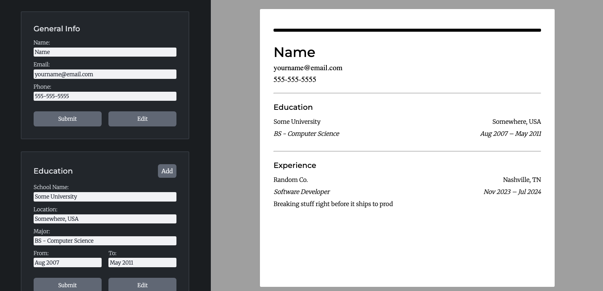
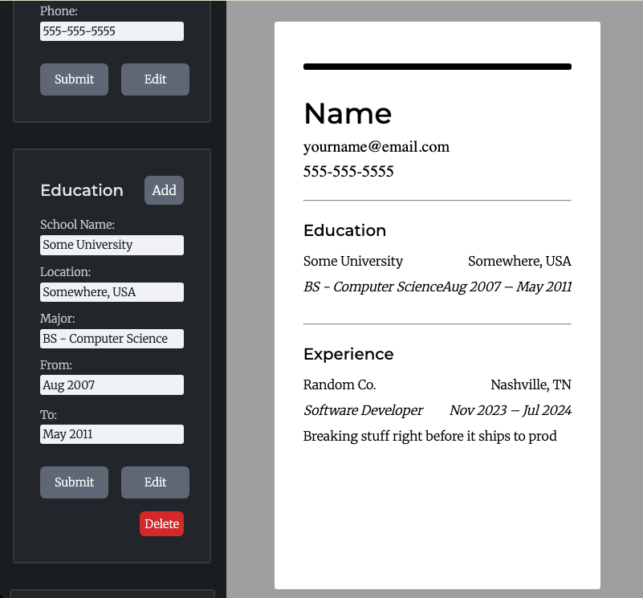
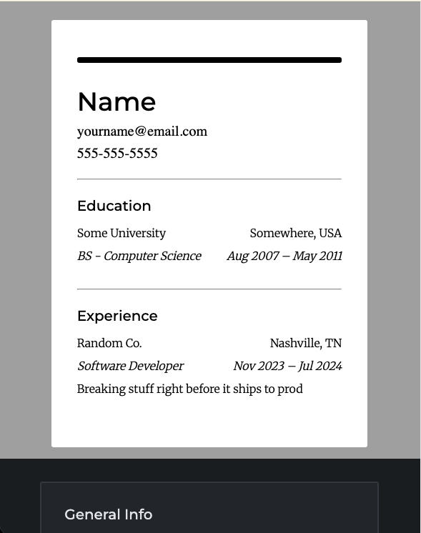

# 📄 CV Application

CV Application for building resumes. Developed for [The Odin Project](https://www.theodinproject.com/) curriculum.

## 💻 Technologies Used

- React
- Vite
- npm

## ✨ Features

- Resume builder
- Resume preview
- Submit, edit, delete resume fields
- Responsive for tablet and mobile viewing

## What I Learned

- State Management
- Passing Props
- Component Organization

## 🏃‍♂️ To Run

1. Clone Repo

```
git clone https://github.com/SamsDevLab/cv-application.git
cd cv-application
```

2. Install npm

`npm install`

3. Run Dev Server

`npm run dev `

4. Open Vite Dev Server at http://localhost:5173/ in your browser

## 📺 Screenshots

Desktop View



Tablet View



Mobile View


